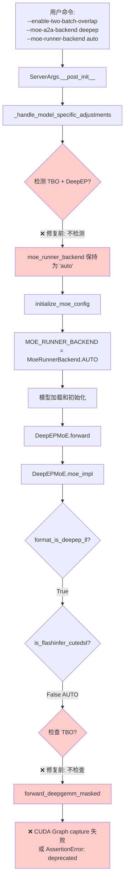
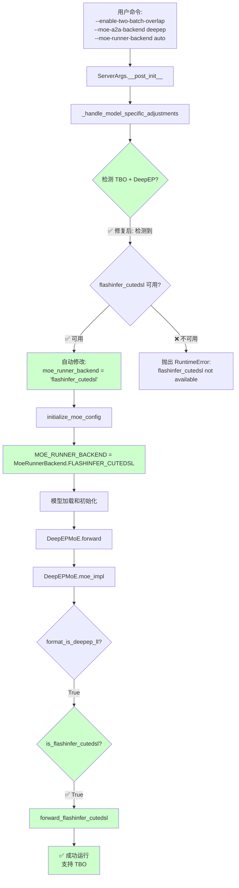
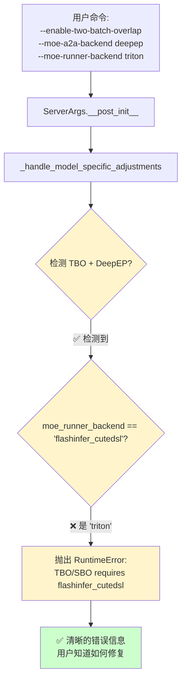

# A01_B01: Bug #16952 修复前后代码对比与详细解释

## 📋 目录
1. [修复位置1：ServerArgs 层面](#修复位置1serverargs-层面)
2. [修复位置2：Layer 层面](#修复位置2layer-层面)
3. [修复理由与逻辑](#修复理由与逻辑)
4. [完整执行流程对比](#完整执行流程对比)
5. [为什么这样修复](#为什么这样修复)

## 相关文档
- [A01: flashinfer_cutedsl 详解](./A01_flashinfer.md) - 了解 flashinfer_cutedsl 是什么
- [A01_B02: 原始解决方案汇总](./A01_B02_original_solutions.md) - 用户方案和 Fridge003 方案

---

## 修复位置1：ServerArgs 层面

### 文件位置
**文件**：`python/sglang/srt/server_args.py`  
**方法**：`_handle_model_specific_adjustments()`  
**行号**：799-821（修复后）

### 代码对比

#### 修复前（Bug 触发版本）

```python
# python/sglang/srt/server_args.py:721-797 (修复前)

def _handle_model_specific_adjustments(self):
    if parse_connector_type(self.model_path) == ConnectorType.INSTANCE:
        return

    hf_config = self.get_hf_config()
    model_arch = hf_config.architectures[0]
    
    if model_arch in ["GptOssForCausalLM"]:
        # ... GptOssForCausalLM 的处理逻辑 ...
        if (
            self.moe_runner_backend == "auto"
            and self.ep_size == 1
            and is_triton_kernels_available()
        ):
            self.moe_runner_backend = "triton_kernel"
        # ...
    
    elif "Llama4" in model_arch and self.device != "cpu":
        # ... Llama4 的处理逻辑 ...
    
    elif model_arch in ["Gemma2ForCausalLM", ...]:
        # ... Gemma 的处理逻辑 ...
        self.disable_hybrid_swa_memory = True
    
    # ❌ 修复前：这里没有任何 TBO/SBO + DeepEP 的自动选择逻辑
    # ❌ 方法直接结束，moe_runner_backend 保持为 "auto"
```

#### 修复后（当前版本）

```python
# python/sglang/srt/server_args.py:799-821 (修复后)

def _handle_model_specific_adjustments(self):
    # ... 前面的代码相同 ...
    
    elif model_arch in ["Gemma2ForCausalLM", ...]:
        # ... Gemma 的处理逻辑 ...
        self.disable_hybrid_swa_memory = True

    # ✅ 修复后：添加 TBO/SBO + DeepEP 的自动选择逻辑
    # Fix for Bug #16952: Auto-select flashinfer_cutedsl when TBO/SBO + DeepEP is enabled
    if self.enable_two_batch_overlap or self.enable_single_batch_overlap:
        if self.moe_a2a_backend == "deepep":
            if self.moe_runner_backend == "auto" or self.moe_runner_backend is None:
                # Check if flashinfer_cutedsl is available
                try:
                    from flashinfer.cute_dsl.blockscaled_gemm import grouped_gemm_nt_masked
                    self.moe_runner_backend = "flashinfer_cutedsl"  # ✅ 自动修改
                    logger.info(
                        "TBO/SBO is enabled with DeepEP. "
                        "Automatically using flashinfer_cutedsl backend for overlap optimization."
                    )
                except ImportError:
                    raise RuntimeError(
                        "TBO/SBO requires --moe-runner-backend flashinfer_cutedsl, "
                        "but flashinfer_cutedsl is not available. "
                        "Please install flashinfer with cutedsl support."
                    )
            elif self.moe_runner_backend != "flashinfer_cutedsl":
                raise RuntimeError(
                    "TBO/SBO requires --moe-runner-backend flashinfer_cutedsl. "
                    "Please use --moe-runner-backend flashinfer_cutedsl."
                )
```

### 关键区别

| 方面 | 修复前 | 修复后 |
|------|--------|--------|
| **检测 TBO/SBO** | ❌ 不检测 | ✅ 检测 `enable_two_batch_overlap` 或 `enable_single_batch_overlap` |
| **检测 DeepEP** | ❌ 不检测 | ✅ 检测 `moe_a2a_backend == "deepep"` |
| **检测 auto** | ❌ 不检测 | ✅ 检测 `moe_runner_backend == "auto"` |
| **自动选择** | ❌ 不选择 | ✅ 自动设置 `moe_runner_backend = "flashinfer_cutedsl"` |
| **错误处理** | ❌ 无 | ✅ 如果 flashinfer_cutedsl 不可用，抛出清晰的 RuntimeError |
| **用户指定错误 backend** | ❌ 无检查 | ✅ 如果用户指定了错误的 backend，抛出 RuntimeError |

---

## 修复位置2：Layer 层面

### 文件位置
**文件**：`python/sglang/srt/layers/moe/ep_moe/layer.py`  
**方法**：`moe_impl()`  
**行号**：490-503（修复后）

### 代码对比

#### 修复前（Bug 触发版本）

```python
# python/sglang/srt/layers/moe/ep_moe/layer.py:490-503 (修复前)

elif DispatchOutputChecker.format_is_deepep_ll(dispatch_output):
    # ✅ 检查1：是否使用 flashinfer_cutedsl backend
    if get_moe_runner_backend().is_flashinfer_cutedsl():
        return self.forward_flashinfer_cutedsl(
            dispatch_output, down_gemm_overlap_args=down_gemm_overlap_args
        )
    
    # ❌ 修复前：这里没有 TBO/SBO 的检查
    # ❌ 如果 backend 不是 flashinfer_cutedsl，直接走到 forward_deepgemm_masked
    # ❌ 即使 TBO 启用，也不会报错，会走到 deprecated 路径
    
    assert deep_gemm_wrapper.ENABLE_JIT_DEEPGEMM and self.use_fp8_w8a8
    return self.forward_deepgemm_masked(dispatch_output)  # ⚠️ 已废弃，不支持 TBO
```

#### 修复后（当前版本）

```python
# python/sglang/srt/layers/moe/ep_moe/layer.py:490-503 (修复后)

elif DispatchOutputChecker.format_is_deepep_ll(dispatch_output):
    # ✅ 检查1：是否使用 flashinfer_cutedsl backend
    if get_moe_runner_backend().is_flashinfer_cutedsl():
        return self.forward_flashinfer_cutedsl(
            dispatch_output, down_gemm_overlap_args=down_gemm_overlap_args
        )
    
    # ✅ 修复后：添加 TBO/SBO 检查（双重保护）
    # Fix for Bug #16952: Double-check to prevent using deprecated forward_deepgemm_masked
    # when TBO/SBO is enabled
    if down_gemm_overlap_args is not None or is_tbo_enabled():
        raise RuntimeError(
            "TBO/SBO requires --moe-runner-backend flashinfer_cutedsl. "
            "Please use --moe-runner-backend flashinfer_cutedsl."
        )
    
    assert deep_gemm_wrapper.ENABLE_JIT_DEEPGEMM and self.use_fp8_w8a8
    return self.forward_deepgemm_masked(dispatch_output)  # ⚠️ 已废弃，不支持 TBO
```

### 关键区别

| 方面 | 修复前 | 修复后 |
|------|--------|--------|
| **TBO/SBO 检查** | ❌ 无检查 | ✅ 检查 `down_gemm_overlap_args is not None` 或 `is_tbo_enabled()` |
| **提前报错** | ❌ 无 | ✅ 如果 TBO 启用但 backend 不对，抛出清晰的 RuntimeError |
| **错误信息** | ❌ 无 | ✅ 提供清晰的错误信息和解决建议 |
| **双重保护** | ❌ 无 | ✅ ServerArgs 层面 + Layer 层面双重保护 |

---

## 修复理由与逻辑

### 1. 为什么需要修复？

#### 问题根源
- **TBO (Two-Batch Overlap)** 是一个性能优化特性，需要特定的 backend 支持
- **`forward_deepgemm_masked()`** 函数**不支持 TBO**，已被标记为 deprecated
- 当用户启用 TBO + DeepEP 时，如果 backend 是 `"auto"`，代码会走到 `forward_deepgemm_masked()`
- 结果：CUDA Graph capture 失败或触发 deprecated assert

#### 为什么 `"auto"` 不会自动选择正确的 backend？
- `"auto"` 只是一个字符串值，会被转换为 `MoeRunnerBackend.AUTO` 枚举值
- `MoeRunnerBackend.AUTO` 是一个**独立的枚举值**，不等于任何其他 backend
- 代码中没有针对 TBO + DeepEP 的特殊处理逻辑
- 因此 `"auto"` **不会自动解析**成 `flashinfer_cutedsl`

### 2. 修复逻辑

#### 修复策略：两层保护

**第一层：ServerArgs 层面（主动修复）**
- **时机**：在参数解析阶段，模型加载之前
- **逻辑**：检测到 TBO/SBO + DeepEP + auto → 自动修改 `moe_runner_backend = "flashinfer_cutedsl"`
- **优点**：
  - 提前解决问题，避免后续错误
  - 用户无需手动指定参数
  - 提供清晰的日志信息

**第二层：Layer 层面（防御性检查）**
- **时机**：在 MoE 实现选择时，实际执行前
- **逻辑**：如果 TBO 启用但 backend 不是 `flashinfer_cutedsl` → 抛出清晰的 RuntimeError
- **优点**：
  - 双重保护，即使 ServerArgs 层面漏了，Layer 层面也能捕获
  - 提供清晰的错误信息，帮助用户快速定位问题
  - 避免走到 deprecated 路径，导致难以理解的错误

### 3. 为什么选择 `flashinfer_cutedsl`？

#### 技术原因
1. **TBO 优化需要**：
   - TBO 需要在 MoE 计算时支持 overlap 优化
   - `forward_flashinfer_cutedsl()` 支持 `down_gemm_overlap_args` 参数
   - `forward_deepgemm_masked()` 不支持 TBO

2. **DeepEP Low Latency 模式**：
   - DeepEP LL 模式需要高效的 MoE 实现
   - `flashinfer_cutedsl` 是专门为 DeepEP LL 模式优化的 backend

3. **代码证据**：
   ```python
   # forward_flashinfer_cutedsl 支持 TBO
   def forward_flashinfer_cutedsl(
       self,
       dispatch_output: DeepEPLLOutput,
       down_gemm_overlap_args: Optional[DownGemmOverlapArgs] = None,  # ✅ 支持 TBO
   ):
       # ...
   
   # forward_deepgemm_masked 不支持 TBO
   def forward_deepgemm_masked(
       self,
       dispatch_output: DeepEPLLOutput,
       # ❌ 没有 down_gemm_overlap_args 参数
   ):
       # ...
   ```

---

## 完整执行流程对比

### 修复前的流程（Bug 触发）



### 修复后的流程（成功运行）



### 修复后的流程（防御性检查触发）



---

## 为什么这样修复

### 1. 为什么在 ServerArgs 层面修复？

#### 理由
- **时机早**：在参数解析阶段就修复，避免后续所有问题
- **用户体验好**：用户无需手动指定参数，自动选择正确的 backend
- **清晰明确**：提供日志信息，告知用户自动选择了什么

#### 逻辑
```python
# 修复逻辑
if TBO/SBO 启用:
    if DeepEP 启用:
        if backend 是 auto:
            if flashinfer_cutedsl 可用:
                自动选择 flashinfer_cutedsl  # ✅ 主动修复
            else:
                抛出错误，提示安装  # ✅ 提前发现问题
        elif backend 不是 flashinfer_cutedsl:
            抛出错误，提示使用 flashinfer_cutedsl  # ✅ 防止错误配置
```

### 2. 为什么在 Layer 层面也添加检查？

#### 理由
- **双重保护**：即使 ServerArgs 层面漏了（比如代码版本不同），Layer 层面也能捕获
- **防御性编程**：在实际执行前最后一道防线
- **清晰的错误信息**：如果走到这里，说明配置有问题，提供清晰的错误信息

#### 逻辑
```python
# 防御性检查逻辑
if backend 不是 flashinfer_cutedsl:
    if TBO/SBO 启用:
        抛出 RuntimeError  # ✅ 避免走到 deprecated 路径
    else:
        继续执行（不使用 TBO，可以走 deprecated 路径）
```

### 3. 为什么检查 `down_gemm_overlap_args` 和 `is_tbo_enabled()`？

#### 理由
- **`down_gemm_overlap_args`**：这是 TBO 优化传递的参数，如果它不为 None，说明 TBO 正在使用
- **`is_tbo_enabled()`**：这是全局状态，检查 TBO 是否启用
- **双重检查**：确保不会漏掉任何 TBO 启用的场景

#### 逻辑
```python
# 检查逻辑
if down_gemm_overlap_args is not None:
    # TBO 正在使用（通过参数传递）
    需要 flashinfer_cutedsl
elif is_tbo_enabled():
    # TBO 全局启用（通过全局状态）
    需要 flashinfer_cutedsl
else:
    # TBO 未启用，可以使用 deprecated 路径
    可以继续
```

---

## 修复的关键点总结

### 1. 问题本质
- **TBO + DeepEP + auto** → 代码走到 `forward_deepgemm_masked()` → 不支持 TBO → Bug

### 2. 修复策略
- **ServerArgs 层面**：主动修复，自动选择正确的 backend
- **Layer 层面**：防御性检查，避免走到 deprecated 路径

### 3. 修复逻辑
- **检测条件**：TBO/SBO + DeepEP + auto
- **修复动作**：自动设置 `moe_runner_backend = "flashinfer_cutedsl"`
- **错误处理**：如果不可用或配置错误，抛出清晰的 RuntimeError

### 4. 为什么有效
- **提前修复**：在参数解析阶段就修复，避免后续所有问题
- **双重保护**：ServerArgs + Layer 两层检查，确保不会漏掉
- **清晰错误**：如果配置错误，提供清晰的错误信息和解决建议

---

## 代码位置总结

### 修复位置1：ServerArgs
- **文件**：`python/sglang/srt/server_args.py`
- **方法**：`_handle_model_specific_adjustments()`
- **行号**：799-821
- **作用**：自动选择 `flashinfer_cutedsl` backend

### 修复位置2：Layer
- **文件**：`python/sglang/srt/layers/moe/ep_moe/layer.py`
- **方法**：`moe_impl()`
- **行号**：497-501
- **作用**：防御性检查，避免走到 deprecated 路径

---

## 测试验证

### 修复前（Bug 触发）
```bash
# 命令
python3 -m sglang.launch_server \
    --model-path /dev/shm/qwen30b/qwen30b \
    --tp 8 --ep 8 \
    --enable-two-batch-overlap \
    --moe-a2a-backend deepep

# 结果
❌ AssertionError: forward_deepgemm_masked is deprecated
```

### 修复后（成功运行）
```bash
# 命令（相同）
python3 -m sglang.launch_server \
    --model-path /dev/shm/qwen30b/qwen30b \
    --tp 8 --ep 8 \
    --enable-two-batch-overlap \
    --moe-a2a-backend deepep

# 结果
✅ 自动选择 flashinfer_cutedsl backend
✅ 成功运行，支持 TBO
```

---

## 详细逻辑解释

### 1. 为什么 `"auto"` 不会自动解析？

#### 代码证据
```python
# python/sglang/srt/layers/moe/utils.py:44-70

class MoeRunnerBackend(Enum):
    AUTO = "auto"                    # ⚠️ 独立的枚举值
    TRITON = "triton"
    FLASHINFER_CUTEDSL = "flashinfer_cutedsl"  # ⚠️ 另一个独立的枚举值
    
    def is_flashinfer_cutedsl(self):
        return self == MoeRunnerBackend.FLASHINFER_CUTEDSL  # ⚠️ 只有等于才返回 True
```

#### 逻辑解释
- `MoeRunnerBackend.AUTO` 和 `MoeRunnerBackend.FLASHINFER_CUTEDSL` 是**两个不同的枚举值**
- `AUTO != FLASHINFER_CUTEDSL`，所以 `is_flashinfer_cutedsl()` 返回 `False`
- **没有代码**会自动将 `AUTO` 解析成 `FLASHINFER_CUTEDSL`
- 必须在某个地方**显式地**将字符串 `"auto"` 改成 `"flashinfer_cutedsl"`

### 2. 为什么在 ServerArgs 层面修改字符串值有效？

#### 执行顺序
```python
# 执行顺序
1. ServerArgs.__post_init__()
   └─> _handle_model_specific_adjustments()  # ⚠️ 在这里修改字符串值
       └─> self.moe_runner_backend = "flashinfer_cutedsl"  # ✅ 修改字符串

2. initialize_moe_config(server_args)
   └─> MOE_RUNNER_BACKEND = MoeRunnerBackend(server_args.moe_runner_backend)
       └─> 读取的是 "flashinfer_cutedsl"（已修改）  # ✅ 读取修改后的值
```

#### 逻辑解释
- `_handle_model_specific_adjustments()` 在 `initialize_moe_config()` **之前**执行
- 修改 `server_args.moe_runner_backend` 字符串值，会影响后续的枚举转换
- 这是**唯一**能影响 `initialize_moe_config()` 的地方

### 3. 为什么需要双重保护？

#### 场景1：ServerArgs 层面修复成功
```
用户命令: --enable-two-batch-overlap --moe-a2a-backend deepep
    ↓
ServerArgs: 自动选择 flashinfer_cutedsl ✅
    ↓
Layer: is_flashinfer_cutedsl() → True ✅
    ↓
成功运行 ✅
```

#### 场景2：ServerArgs 层面修复失败（比如代码版本不同）
```
用户命令: --enable-two-batch-overlap --moe-a2a-backend deepep
    ↓
ServerArgs: 没有自动选择逻辑（旧版本代码）
    ↓
Layer: is_flashinfer_cutedsl() → False
    ↓
Layer: 检查 TBO → True
    ↓
Layer: 抛出 RuntimeError ✅（清晰的错误信息）
```

#### 逻辑解释
- **ServerArgs 层面**：主动修复，解决大部分问题
- **Layer 层面**：防御性检查，处理边缘情况（代码版本不同、配置错误等）
- **双重保护**：确保无论什么情况，都不会走到 deprecated 路径

### 4. 为什么检查 `down_gemm_overlap_args` 和 `is_tbo_enabled()`？

#### 代码证据
```python
# python/sglang/srt/layers/moe/ep_moe/layer.py:497

if down_gemm_overlap_args is not None or is_tbo_enabled():
    raise RuntimeError(...)
```

#### 逻辑解释
- **`down_gemm_overlap_args`**：
  - 这是 TBO 优化传递的参数对象
  - 如果它不为 `None`，说明 TBO 正在**实际使用**
  - 这是**最直接**的检查方式

- **`is_tbo_enabled()`**：
  - 这是全局状态，检查 TBO 是否**启用**
  - 即使 `down_gemm_overlap_args` 为 `None`（比如某些路径），也能检查到 TBO 启用

- **`or` 逻辑**：
  - 只要**任何一个**为 True，就说明 TBO 启用
  - 确保不会漏掉任何 TBO 启用的场景

---

## 修复的完整逻辑流程

### 修复逻辑（伪代码）

```python
# ServerArgs 层面（主动修复）
def _handle_model_specific_adjustments(self):
    # ... 其他模型特定的调整 ...
    
    # ✅ 修复逻辑
    if TBO_启用 or SBO_启用:
        if DeepEP_启用:
            if backend == "auto":
                if flashinfer_cutedsl_可用:
                    backend = "flashinfer_cutedsl"  # ✅ 自动选择
                    记录日志
                else:
                    抛出错误：flashinfer_cutedsl 不可用
            elif backend != "flashinfer_cutedsl":
                抛出错误：TBO/SBO 需要 flashinfer_cutedsl

# Layer 层面（防御性检查）
def moe_impl(self, dispatch_output, down_gemm_overlap_args=None):
    if format_is_deepep_ll(dispatch_output):
        if is_flashinfer_cutedsl():
            return forward_flashinfer_cutedsl(...)  # ✅ 成功路径
        
        # ✅ 防御性检查
        if TBO_正在使用 or TBO_启用:
            抛出错误：TBO/SBO 需要 flashinfer_cutedsl  # ✅ 避免走到 deprecated
        
        return forward_deepgemm_masked(...)  # ⚠️ deprecated 路径（不使用 TBO 时）
```

### 修复的决策树

```
用户命令: --enable-two-batch-overlap --moe-a2a-backend deepep
    ↓
ServerArgs._handle_model_specific_adjustments()
    ↓
TBO 启用? → ✅ 是
    ↓
DeepEP 启用? → ✅ 是
    ↓
backend == "auto"? → ✅ 是
    ↓
flashinfer_cutedsl 可用? → ✅ 是
    ↓
✅ 自动设置: backend = "flashinfer_cutedsl"
    ↓
initialize_moe_config()
    ↓
MOE_RUNNER_BACKEND = FLASHINFER_CUTEDSL
    ↓
Layer.moe_impl()
    ↓
is_flashinfer_cutedsl()? → ✅ True
    ↓
✅ forward_flashinfer_cutedsl() → 成功运行
```

---

## 总结

### 修复的核心思想
1. **主动修复**：在参数解析阶段自动选择正确的 backend
2. **防御性检查**：在实际执行前最后一道防线
3. **清晰错误**：如果配置错误，提供清晰的错误信息和解决建议

### 修复的有效性
- ✅ 解决了 Bug：TBO + DeepEP + auto 现在能正常工作
- ✅ 改善了用户体验：用户无需手动指定参数
- ✅ 提高了代码健壮性：双重保护，避免类似问题

### 修复的关键点
1. **时机**：在 `initialize_moe_config()` 之前修改字符串值
2. **位置**：ServerArgs 层面（主动）+ Layer 层面（防御）
3. **逻辑**：检测 TBO/SBO + DeepEP + auto → 自动选择 flashinfer_cutedsl
4. **保护**：双重检查，确保不会走到 deprecated 路径
