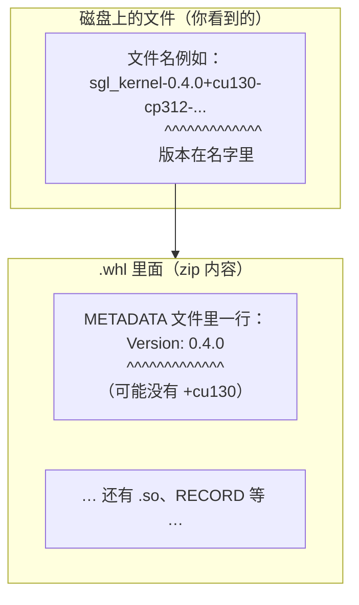
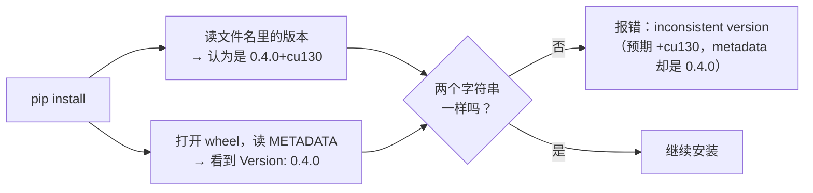
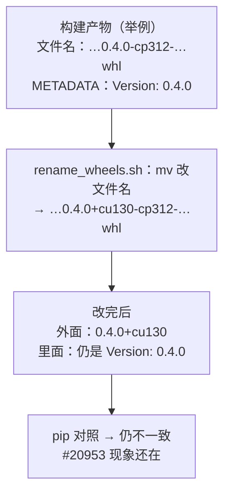
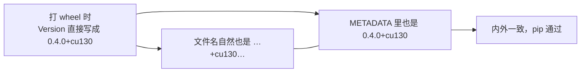
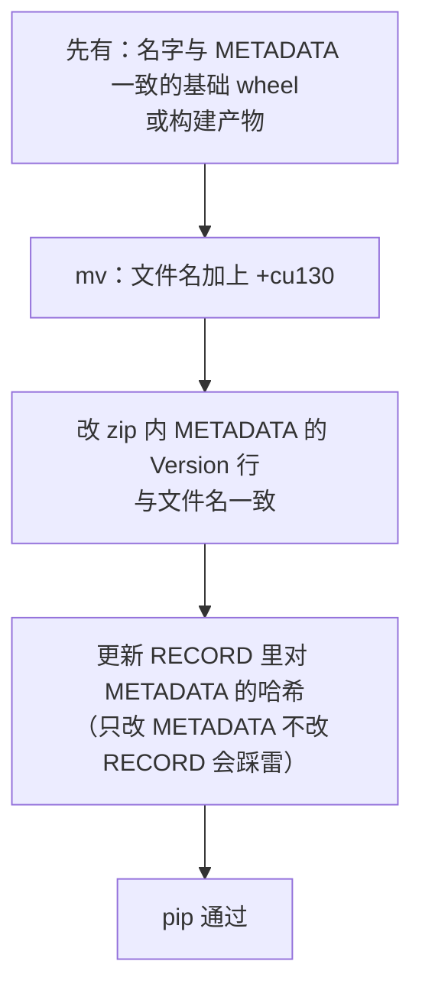

# #20953 图解：到底是什么 bug、怎么才算修对

**Issue**：wheel **文件名**里的版本 和 **包内 `METADATA`** 里的 `Version:` 不一致 → `pip` 报 *inconsistent version*。

下面用图说明；文中「当前仓库里的 rename 脚本」指只做 `mv`、**不**改 zip 内部的那版。

---

## 1. wheel 是什么（一层皮 + 一盒东西）

`.whl` 本质是 **zip**。用户磁盘上看到的是**文件名**；`pip` 安装时还会打开 zip 读里面的元数据。



**要点**：存在 **两个地方** 都在描述「这个包是哪个版本」——**外面名字** 和 **里面 `Version:`**。pip 要求它们 **对得上**。

---

## 2. bug 时 pip 在想什么（逻辑上在卡什么）



**所以 bug 不是「pip 抽风」**，而是：**你只改了「对外展示的名字」，没改「包自己声明的版本」**，两套信息打架。

---

## 3. 只做 rename（只 `mv`）时发生了什么



这就是前面说的：**只走「改名」这一步，不算修完**（除非别处已经把 `METADATA` 改好了）。

---

## 4. 两种「修对」的方式（二选一即可闭环）

### 路线 A：构建时就对齐（推荐长期）



**特点**：单一真相来源，少事后动 zip。

### 路线 B：rename 之后再修内部（务实，但要整包改对）



**特点**：能接上现有「先打通用包再按 CUDA 改名」的流程，但脚本/CI 必须 **METADATA + RECORD** 一起处理，否则会有新坑。

---

## 5. 调用结构（call flow）：谁调谁、产物从哪来

### 5.1 CUDA：`sgl-kernel` 打 wheel + `rename_wheels.sh`

与 #20953 直接相关的是：**`uv build` 产出 wheel 之后**，立刻执行 **`rename_wheels.sh`（当前实现只有 `mv`）**。

**读图说明**：Mermaid 里每个节点有个 **ID**（下面用英文单词，方便连线），**真正含义看方框里的文字**。例如 **`uv`** 指工具 **[uv](https://github.com/astral-sh/uv)**（Astral 的包/构建工具），**不是** “UV 光” 之类。

```mermaid
flowchart TD
  subgraph ci["CI：`.github/workflows/release-whl-kernel.yml`"]
    cuda_job["job：CUDA matrix\n`cd sgl-kernel`"]
  end

  subgraph host["宿主机 / runner"]
    run_build_sh["运行 `sgl-kernel/build.sh`\n参数：`<python> <cuda> [arch]`"]
  end

  subgraph docker["容器内工作目录 `/sgl-kernel`"]
    uv_build_wheel["`python -m uv build --wheel ...`\n（用 **uv** 打 wheel）\n→ `dist/*.whl`\n包内 `METADATA` 的 `Version:` 由**这一步**决定"]
    run_rename_cuda["`./rename_wheels.sh`\n只改**磁盘上的文件名**\n（`linux`→`manylinux2014`，加 `+cu124/128/130`）"]
  end

  dockerfile_build["并行路径：`sgl-kernel/Dockerfile` 的 build stage\n同样是 `uv build` → `./rename_wheels.sh`"]

  cuda_job --> run_build_sh
  run_build_sh --> uv_build_wheel
  dockerfile_build --> uv_build_wheel
  uv_build_wheel --> run_rename_cuda
  run_rename_cuda --> dist_out["`sgl-kernel/dist/*.whl`\n→ 上传 index / release"]

  style run_rename_cuda fill:#ffe6e6
```

**高亮**：红色步骤是 #20953 的「矛盾」容易产生处——**若只 `mv`、未同步改 zip 内 `Version:`**，则下一步 **用户 `pip`** 会对照失败。（以前图里用 `BS`/`UV` 当节点 ID 容易误解，已改成上面这种长名字。）

---

### 5.2 ROCm：`build_rocm.sh` + `rename_wheels_rocm.sh`

```mermaid
flowchart LR
  run_build_rocm["`3rdparty/amd/wheel/sgl-kernel/build_rocm.sh`"]
  docker_rocm["容器里 `docker run` ROCm 镜像\n`cd /sgl-kernel`"]
  uv_wheel_rocm["`uv build --wheel`"]
  run_rename_rocm["`./rename_wheels_rocm.sh`\n（`+rocm…`，当前同为 `mv`）"]
  run_build_rocm --> docker_rocm --> uv_wheel_rocm --> run_rename_rocm --> dist_rocm["`dist/*.whl`"]
```

CI 里常见：先把 `3rdparty/amd/wheel/sgl-kernel/*` **拷进** `sgl-kernel/`，再走同类构建（见 workflow 里 `cp 3rdparty/amd/...`）。

---

### 5.3 MUSA（workflow 里单独一步）

```mermaid
flowchart LR
  W["`release-whl-kernel.yml`\nMUSA job"]
  M["`bash scripts/ci/musa/rename_wheels_musa.sh`\n`<musa_ver> sgl-kernel/dist`"]
  W --> M
```

---

### 5.4 用户侧：`pip install` 与 #20953 的「碰撞点」

```mermaid
flowchart TD
  U["用户：`pip install … --index-url …/cu130/`"]
  U --> DL["下载 `.whl`"]
  DL --> CHK["pip：解析**文件名**中的版本"]
  DL --> UNZ["pip：读 zip 内 `METADATA` 的 `Version:`"]
  CHK --> CMP{一致？}
  UNZ --> CMP
  CMP -->|否| E20953["`inconsistent version`（#20953）"]
  CMP -->|是| INS["解压安装 / RECORD 校验…"]
```

---

## 6. 和「我们是怎么修的」对齐一句话

| 说法 | 含义 |
|------|------|
| **问题本质** | 文件名里的版本 ≠ `METADATA` 里的 `Version:`。 |
| **只 `mv`** | 只动了左边，**没**动右边 → **通常还没修掉**。 |
| **算修对** | 要么 **构建** 就一致（路线 A），要么 **改名后把内部改到一致且 RECORD 正确**（路线 B）。 |

你们本地的 `bug_20953_analysis` 里那套验证，是在回答：**「产物是否内外一致」**；和「仓库里 rename 脚本是否已经实现路线 B 的完整步骤」要分开看。

---

## 7. 纯 ASCII 小结（不渲染 Mermaid 时也能读）

```
[ 文件名 ]     sgl_kernel-0.4.0+cu130-....whl
                    |
                    |    pip：这两处必须一致
                    v
[ METADATA ]   Version: 0.4.0        <-- bug：缺 +cu130
               Version: 0.4.0+cu130  <-- 修对
```

如需把本文链进总 README，可在 `bug_20953_analysis/README.md` 的表格中加一行指向本文件。
